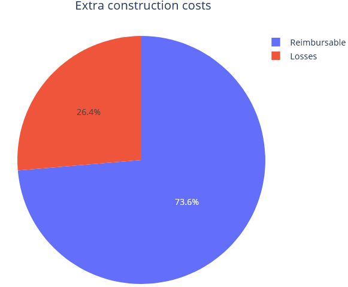

# NLP_Contractor_Classification

## Introduction

Recently I've been learning about Natural Language Processing which basically involves transforming text data into a format that a machine learning algorithm can understand. Every time I learn a new ML concept I always look back at my previous work experiences and think about how what I'm learning now could have helped me do my job better or automate some tasks. After learning some of the basics of NLP I was eager to try out this concept myself on a dataset that interests me personally.

  

## Dataset Source

During my time as construction manager, I was tasked with creating a dataset of extra construction work that was being carried out for a project. This dataset contained 550 rows and the following columns:

- **Date**: Date of invoice
- **invoice_Nr.**: Unique invoice number
- **work_description**: Short description of the carried out work/service
- **building**: Name of building where work was carried out
- **total_cost**: Total cost of work in €
- **reimbursement_rqst**: Identified cost bearer (Company/contractor responsible for the needed extra work)
- **reimbursement_amount**: Amount cost bearer must pay
- **proof_type**: Type of invoice
- **total_manhours**: Extra work measured in man-hours
- **contractor_type**: Contractor/company that carried out the extra work

## Goal of this Project

My goal was to use NLP along with some classifying algorithms in order to classify contractors based on the description of the work that they have done. And also to practice some visualizations with plotly.

- Example from description column:
  

## My Workflow

1. Cleaned the raw data and checked for null values
2. Explored and visualized the data
3. prepared the 'work_description' column by:

    - Removing common words and punctuation
    - Tokenizing the descriptions (convert each description into a list of words)
    - Performing vectorization: use SciKit Learn's bag-of-words model
    
4. Ensemble testing with Multiple Linear Regression, Random Forest, K-NN, and Naive Bayes classifier 

 
  
 
 

## Results

| Classifier                 | accuracy |
|----------------------------|----------|
| Multiple Linear Regression | 0.90     |
| Random Forest              | 0.88     |
| K-NN                       | 0.75     |
| Naive Bayes                | 0.89     |
